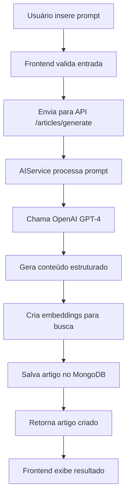
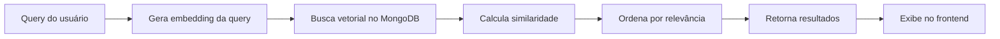
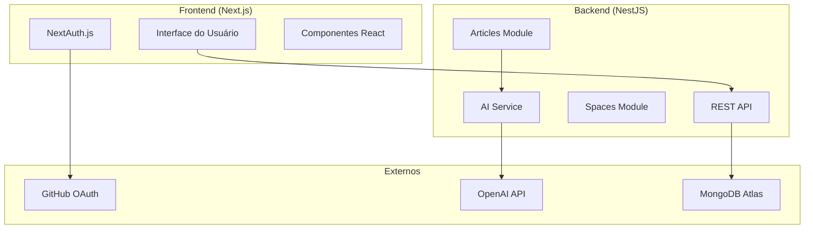

<div align="center">
  <h1>🧠 Knowledge Base AI</h1>
  <p><strong>Base de Conhecimento interna potencializada por IA</strong></p>
  
  <p>
    <a href="https://knowledge-base-ai-eosin.vercel.app/" target="_blank">
      
    </a>
    <a href="https://api-production-43ba.up.railway.app/api/help" target="_blank">
      
    </a>
  </p>
  
  <p>
    
    
    
    
    
    
  </p>
</div>

## 📋 Sobre o Projeto

O **Knowledge Base AI** é uma plataforma moderna para gerenciamento de conhecimento interno, potencializada por Inteligência Artificial. Permite criar, organizar e pesquisar artigos de forma inteligente, com geração automática de conteúdo via OpenAI e busca semântica avançada.

## ✨ Features Implementadas

- [x] 🔐 **Autenticação GitHub OAuth** - Login seguro via GitHub
- [x] 📝 **Criação de Artigos** - Editor completo com suporte a Markdown
- [x] 🤖 **Geração de Conteúdo IA** - Criação automática via OpenAI GPT
- [x] 🔍 **Busca Semântica** - Pesquisa inteligente com embeddings
- [x] 📁 **Organização por Spaces** - Categorização de artigos
- [x] 🏷️ **Sistema de Tags** - Classificação e filtragem
- [x] 📱 **Interface Responsiva** - Design moderno com Tailwind CSS
- [x] 🧪 **Testes Automatizados** - Cobertura completa com Jest
- [x] 🚀 **CI/CD Pipeline** - Integração contínua com GitHub Actions
- [x] 📊 **Monitoramento** - Logs estruturados e métricas

## 🏗️ Arquitetura do Projeto

### 📁 Estrutura do Repositório

```
kb-ia/
├── apps/
│   ├── api/                 # Backend NestJS
│   │   ├── src/
│   │   │   ├── articles/    # Módulo de artigos
│   │   │   ├── spaces/      # Módulo de spaces
│   │   │   ├── ai/          # Serviços de IA
│   │   │   └── auth/        # Autenticação
│   │   └── test/            # Testes E2E
│   └── web/                 # Frontend Next.js
│       ├── app/             # App Router
│       ├── components/      # Componentes React
│       ├── lib/             # Utilitários
│       └── styles/          # Estilos globais
├── packages/
│   ├── ui/                  # Design System
│   ├── eslint-config/       # Configuração ESLint
│   └── typescript-config/   # Configuração TypeScript
├── .github/workflows/       # CI/CD
└── turbo.json              # Configuração Turbo
```

### 🤖 Fluxo de Geração de Conteúdo IA



### 🔍 Fluxo de Busca Semântica



### 🏛️ Arquitetura de Sistema



## 🛠️ Stack Tecnológica

### Frontend

- **Next.js 14** - Framework React com App Router
- **TypeScript** - Tipagem estática
- **Tailwind CSS** - Estilização utilitária
- **NextAuth.js** - Autenticação
- **React Hook Form** - Gerenciamento de formulários
- **Radix UI** - Componentes acessíveis

### Backend

- **NestJS** - Framework Node.js escalável
- **MongoDB** - Banco de dados NoSQL
- **Mongoose** - ODM para MongoDB
- **OpenAI API** - Inteligência Artificial
- **JWT** - Autenticação stateless
- **Class Validator** - Validação de dados

### DevOps & Ferramentas

- **Turbo** - Monorepo build system
- **pnpm** - Gerenciador de pacotes
- **ESLint + Prettier** - Qualidade de código
- **Jest** - Testes unitários e integração
- **GitHub Actions** - CI/CD

## 🚀 Setup Local

### Instalação

```bash
pnpm install
```

### Executando o projeto

```bash
pnpm dev
```

Isso iniciará:

- Frontend: http://localhost:3000
- Backend: http://localhost:3001

## Variáveis de Ambiente

### Backend (`apps/api/.env`)

Copie o arquivo de exemplo:

```bash
cp apps/api/.env.example apps/api/.env
```

Variáveis necessárias:

- `NODE_ENV` - Ambiente (development/production)
- `PORT` - Porta do servidor (padrão: 3001)
- `MONGODB_URI` - Connection string do MongoDB Atlas
- `OPENAI_API_KEY` - Chave da API OpenAI (opcional - necessário para features de IA)
- `CORS_ORIGIN` - Origem permitida para CORS (padrão: http://localhost:3000)

### Frontend (`apps/web/.env.local`)

Copie o arquivo de exemplo:

```bash
cp apps/web/.env.example apps/web/.env.local
```

Variáveis necessárias:

- `NEXT_PUBLIC_API_URL` - URL da API (http://localhost:3001)
- `NEXTAUTH_URL` - URL da aplicação (http://localhost:3000)
- `NEXTAUTH_SECRET` - Chave secreta para NextAuth
- `GITHUB_ID` - GitHub OAuth Client ID (obrigatório)
- `GITHUB_SECRET` - GitHub OAuth Client Secret (obrigatório)

#### Como configurar GitHub OAuth

1. Acesse [GitHub Developer Settings](https://github.com/settings/developers)
2. Clique em "New OAuth App"
3. Preencha:
   - **Application name**: Knowledge Base AI (ou qualquer nome)
   - **Homepage URL**: `http://localhost:3000`
   - **Authorization callback URL**: `http://localhost:3000/api/auth/callback/github`
4. Clique em "Register application"
5. Copie o **Client ID** e cole em `GITHUB_ID`
6. Clique em "Generate a new client secret"
7. Copie o **Client Secret** e cole em `GITHUB_SECRET`

## Configuração do MongoDB Atlas

1. Crie uma conta gratuita em [MongoDB Atlas](https://www.mongodb.com/cloud/atlas)
2. Crie um novo cluster (Free Tier M0)
3. Configure o acesso:
   - Adicione seu IP atual na whitelist
   - Crie um usuário de banco de dados
4. Obtenha a connection string:
   - Clique em "Connect" → "Connect your application"
   - Copie a connection string
   - Substitua `<password>` pela senha do usuário
   - Adicione no `.env` como `MONGODB_URI`

## 🔐 Autenticação

O sistema usa **GitHub OAuth** via NextAuth.js para autenticação. Ao fazer login, você será redirecionado para o GitHub para autorizar a aplicação.

A autenticação é totalmente gerenciada pelo NextAuth.js no frontend, sem necessidade de tokens JWT customizados.

## 🧪 Como Testar

### Executar todos os testes

```bash
pnpm test
```

### Executar testes do backend

```bash
cd apps/api && pnpm test
```

### Executar testes do frontend

```bash
cd apps/web && pnpm test
```

### Executar testes com coverage

```bash
pnpm test --coverage
```

### Exemplos de uso da API

#### Criar um artigo

```bash
curl -X POST http://localhost:3001/articles \
  -H "Content-Type: application/json" \
  -d '{
    "title": "Meu Artigo",
    "content": "Conteúdo do artigo...",
    "spaceId": "space-id",
    "tags": ["javascript", "tutorial"]
  }'
```

#### Buscar artigos

```bash
curl "http://localhost:3001/articles/search?query=javascript&limit=10"
```

## 🌐 Deploy em Produção

### 🔗 Links da Aplicação

- **Frontend**: [https://knowledge-base-ai-eosin.vercel.app/](https://knowledge-base-ai-eosin.vercel.app/)
- **API**: [https://api-production-43ba.up.railway.app/api/help](https://api-production-43ba.up.railway.app/api/help)

### 🚀 Plataformas

- **Frontend**: Vercel
- **Backend**: Railway
- **Banco de Dados**: MongoDB Atlas

### Variáveis de ambiente para produção

```bash
# Backend
NODE_ENV=production
MONGODB_URI=mongodb+srv://...
OPENAI_API_KEY=sk-...
CORS_ORIGIN=https://seu-dominio.com

# Frontend
NEXT_PUBLIC_API_URL=https://api.seu-dominio.com
NEXTAUTH_URL=https://seu-dominio.com
NEXTAUTH_SECRET=sua-chave-nextauth
GITHUB_ID=seu-github-client-id
GITHUB_SECRET=seu-github-client-secret
```

## 🔧 Troubleshooting

### Problemas Comuns

#### Erro "Module not found" ou dependências desatualizadas

```bash
# Limpar cache e reinstalar
pnpm clean
rm -rf node_modules
rm pnpm-lock.yaml
pnpm install
```

#### Erro de porta em uso

```bash
# Verificar processos usando as portas
lsof -i :3000  # Frontend
lsof -i :3001  # Backend

# Matar processo específico
kill -9 <PID>

# Ou matar todos os processos Node.js
pkill -f node
```

#### Testes falhando

```bash
# Limpar cache do Jest
pnpm test --clearCache

# Executar testes em modo verbose
pnpm test --verbose

# Executar teste específico
pnpm test -- --testNamePattern="nome do teste"
```

#### Problemas com MongoDB

```bash
# Verificar conexão
ping cluster0.mongodb.net

# Testar connection string
mongosh "sua-connection-string"
```

#### Problemas com OpenAI API

```bash
# Testar chave da API
curl https://api.openai.com/v1/models \
  -H "Authorization: Bearer $OPENAI_API_KEY"
```

#### Build falhando

```bash
# Limpar cache do Turbo
pnpm turbo clean

# Build individual
pnpm --filter api build
pnpm --filter web build
```

### Logs e Debug

```bash
# Logs detalhados do backend
DEBUG=* pnpm --filter api dev

# Logs do frontend
pnpm --filter web dev --debug
```

---
