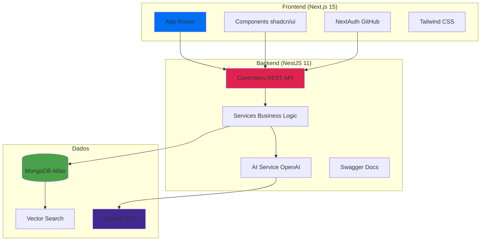
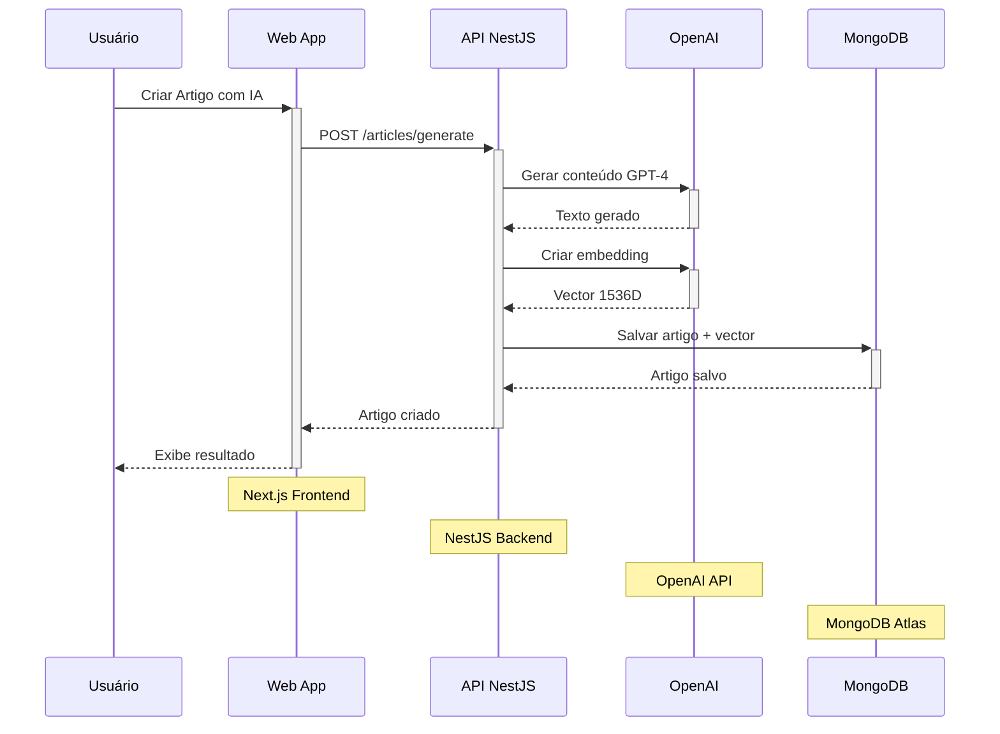

<div align="center">
  <picture>
    <source media="(prefers-color-scheme: dark)" srcset="https://api.iconify.design/material-symbols/menu-book.svg?color=%23ffffff&width=64&height=64">
    <source media="(prefers-color-scheme: light)" srcset="https://api.iconify.design/material-symbols/menu-book.svg?color=%2324292f&width=64&height=64">
    
  </picture>
  <h1><a href="https://knowledge-base-ai-eosin.vercel.app/" target="_blank">Base de Conhecimento</a></h1>
  <p><strong>Plataforma de conhecimento interno potencializada por Inteligência Artificial</strong></p>
  
  <p>
    <a href="https://knowledge-base-ai-eosin.vercel.app/" target="_blank">
      
    </a>
    <a href="https://api-production-43ba.up.railway.app/api/help" target="_blank">
      
    </a>
  </p>
  
  <p>
    
    
    
    
    
    
  </p>
</div>

## Quick Start

```bash
# Clone e instale
git clone https://github.com/eduesplinio/knowledge-base-ai.git
cd knowledge-base-ai
pnpm install

# Configure .env (veja seção Configuração)
cp apps/api/.env.example apps/api/.env
cp apps/web/.env.example apps/web/.env.local

# Execute
pnpm dev
```

**Acesse:** Frontend em http://localhost:3000 | API em http://localhost:3001

## Sobre o Projeto

Plataforma de **conhecimento interno** com IA para criar, organizar e pesquisar artigos de forma inteligente.

**Stack:** Next.js 15 + NestJS 11 + MongoDB + OpenAI + TypeScript

## Índice

- [Quick Start](#quick-start)
- [Features](#features)
- [Stack Tecnológica](#stack-tecnológica)
- [Configuração](#configuração)
- [Arquitetura](#arquitetura)
- [Testes](#testes)
- [Deploy](#deploy)
- [Suporte](#suporte)

## Features

| Categoria    | Features                                                     |
| ------------ | ------------------------------------------------------------ |
| **Auth**     | GitHub OAuth, JWT, Proteção de rotas                         |
| **Conteúdo** | CRUD Spaces/Articles, Editor Markdown, Upload arquivos, Tags |
| **IA**       | Geração GPT-4, Embeddings, Busca semântica vetorial          |
| **UI/UX**    | Responsivo, shadcn/ui, Loading states, Toasts, Sidebar       |
| **DevOps**   | TypeScript, ESLint/Prettier, Jest, Husky, Monorepo           |

## Stack Tecnológica

| Camada       | Tecnologias                                                          |
| ------------ | -------------------------------------------------------------------- |
| **Frontend** | Next.js 15, TypeScript, Tailwind, NextAuth.js, shadcn/ui             |
| **Backend**  | NestJS 11, MongoDB, Mongoose, OpenAI API, JWT, Swagger               |
| **DevOps**   | Turbo (monorepo), pnpm, ESLint/Prettier, Jest, Husky, GitHub Actions |

## Arquitetura

### Estrutura do Monorepo

```
knowledge-base-ai/
├── apps/
│   ├── web/          # Frontend Next.js 15
│   └── api/          # Backend NestJS 11
├── packages/
│   ├── ui/           # Componentes shadcn/ui compartilhados
│   ├── eslint-config/    # Configurações ESLint
│   └── typescript-config/ # Configurações TypeScript
└── .github/workflows/    # CI/CD GitHub Actions
```

### Arquitetura Completa do Sistema



**Fluxo IA:** Prompt → GPT-4 → Embeddings → MongoDB → Busca Semântica

### Fluxo de Geração com IA



## Configuração

### Pré-requisitos

- Node.js 20+, pnpm, MongoDB Atlas, GitHub OAuth, OpenAI API (opcional)

### Variáveis de Ambiente

Copie os arquivos de exemplo e configure:

```bash
# Backend
cp apps/api/.env.example apps/api/.env

# Frontend
cp apps/web/.env.example apps/web/.env.local
```

### MongoDB Atlas Setup

1. Criar cluster gratuito M0
2. Configurar usuário e IP access
3. Criar Vector Search Index na collection `articles`:

```json
{
  "fields": [
    {
      "type": "vector",
      "path": "content_vector",
      "numDimensions": 1536,
      "similarity": "cosine"
    }
  ]
}
```

### GitHub OAuth Setup

1. [GitHub Developer Settings](https://github.com/settings/developers) → New OAuth App
2. Homepage: `http://localhost:3000`
3. Callback: `http://localhost:3000/api/auth/callback/github`

## Deploy

| Serviço      | Plataforma    | Configuração                               |
| ------------ | ------------- | ------------------------------------------ |
| **Frontend** | Vercel        | Root: `apps/web`, Build: `pnpm build`      |
| **Backend**  | Railway       | Root: `apps/api`, Start: `pnpm start:prod` |
| **Database** | MongoDB Atlas | M0 Free Tier                               |

## Testes

### Executar Testes

```bash
# Todos os testes
pnpm test

# Por aplicação
pnpm --filter api test    # Backend (NestJS + Jest)
pnpm --filter web test    # Frontend (React + Jest)

# Com cobertura
pnpm test:coverage

# Modo watch
pnpm test:watch
```

### Estrutura de Testes

| Módulo           | Tipo     | Status                  |
| ---------------- | -------- | ----------------------- |
| **Articles API** | E2E      | Configurado (básico)    |
| **Components**   | Unitário | Testes básicos de UI    |
| **CI/CD**        | Pipeline | ESLint, Prettier, Build |

## Suporte

**Links:**

- [Demo Live](https://knowledge-base-ai-eosin.vercel.app/)
- [API Docs](https://api-production-43ba.up.railway.app/api/help)
- [Repositório](https://github.com/eduesplinio/knowledge-base-ai)

**Recursos:**

- [NestJS Docs](https://docs.nestjs.com/)
- [Next.js Docs](https://nextjs.org/docs)
- [MongoDB Vector Search](https://www.mongodb.com/docs/atlas/atlas-vector-search/)
- [OpenAI API](https://platform.openai.com/docs/api-reference)
